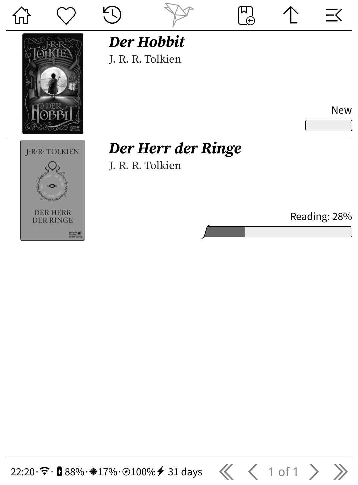

# KOReader.patches
Patches for KOReader

## [2-ignore-non-books-stats](2-ignore-non-books-stats.lua)

Ignores all books not being in `/mnt/onboard/.koreader/Books`.
It disables:
- Reading Stats
- Book History

It also disables creating settings for files which aren't in `/mnt/onboard/.koreader`.

The code was mostly copied from [here](https://github.com/koreader/koreader/issues/10308#issuecomment-1507743114)

## [2-pt-progressbar-1000-pages](2-pt-progressbar-1000-pages.lua)

Increases the Project Title progress bar to show 1000 pages instead of 705.
It does so by making the bar longer and packing more pages into one pixel.

This is just a modified version of [this user patch](https://github.com/loeffner/KOReader.patches/blob/main/project-title/2-pt-modify-progressbar-max-width.lua) configured for my use-case.

## [2-pt-progressbar-and-percentage](2-pt-progressbar-and-percentage.lua)

Shows the read percentage as well as the progress bar.
Only when the book is currently being read or paused.

You can configure it to show the percentage in a new line by setting `show_with_state = false`.

## [2-reading-stats-book-total-percent](2-reading-stats-book-total-percent.lua)

Shows the full percentage up to which point the book was read in Reading Stats > {Book} > Days reading this book.

E.g.: `2026-02-16   00:13:37 (42 pages) -> 13,37%`

I used [this patch](https://github.com/omer-faruq/koreader-user-patches/blob/main/2-reading-stats-current-book-days-percent.lua) as a starter.
