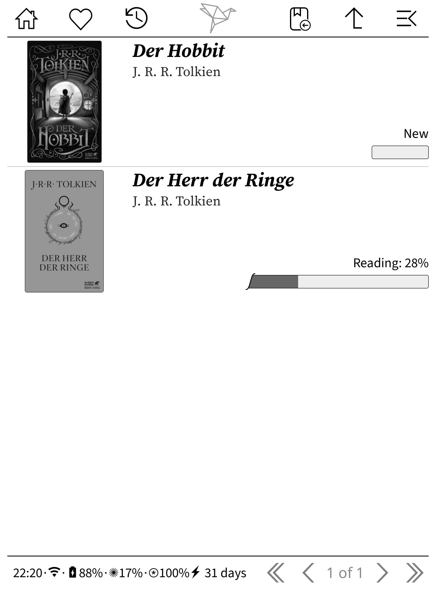

# KOReader.patches
Patches for KOReader

Patches where a folder structure is assumed (like `2-ignore-non-books-stats.lua`) they expect this structure:

/some/path/base
    /Archive
    /Books  <- $home_dir
    /...

For a Kobo device this could be:
/mnt/onboard
    /.adds/koreader
    /Books  <- $home_dir

The idea behind this is that in `/base/Books` all books are stored (this folder can be named differently).  
In `/base` there could be the `Archive`, `Instapaper` or other books you wouldn't want to track like you own books. Maybe knowledge books or books you read to a kid or spouse.

## [2-compact-classic-time](2-compact-classic-time.lua)

By default the time in classic format is `hh:mm(:ss)` no matter if `compact` is set or not.  
This patch will use `h:mm(:ss)` instead when `compact` is used.

You can also set `always_compact = true` this will always omit the leading hour (when `0`).  
Just be sure that some lists might look off when using `always_compact`. The lines might not be aligned correctly anymore:
```
13:37 Test  -> 13:37 Test
01:37 Test  -> 1:37 Test
```

## [2-confirm-first-open-in-books](2-confirm-first-open-in-books.lua)

Shows a dialog when a book in `HOME/.koreader/Books` is opened for the first time.

Derived from [2-confirm-first-open.lua](https://github.com/medinauta/Koreader-Patches/blob/main/2-confirm-first-open.lua).

## [2-duration-format-short](2-duration-format-short.lua) and [2-duration-format-shortest](2-duration-format-shortest.lua)

Those scripts will format all durations in the following pattern:
```
66s  -> 1:06
3606 -> 1:00h
```

### The difference between **short** and **shortest**.
The duration can be configured to hide seconds. They only differ when seconds should be hidden:

```
short:    66s -> 0:01h
shortest: 66s -> 1:06
```

Optionally you can set `show_minutes_unit = true` to show `1:06m` for 66s.

## [2-ignore-non-books-stats](2-ignore-non-books-stats.lua)

Ignores all books not being in `/mnt/onboard/.koreader/Books`.
It disables:
- Reading Stats
- Book History

It also disables creating settings for files which aren't in `/mnt/onboard/.koreader`.

The code was mostly copied from [here](https://github.com/koreader/koreader/issues/10308#issuecomment-1507743114)

## [2-instapaper-folder](2-instapaper-folder.lua)

This patch changes the folder where [instapaper.koplugin](https://github.com/omer-faruq/instapaper.koplugin) saves downloaded articles.
The folder is `$home_dir/../Instapaper`.

## [2-pt-light-dark-folder-icons](2-pt-light-dark-folder-icons.lua) and [2-pt-light-dark-folder-icons-dir](2-pt-light-dark-folder-icons-dir.lua)

Searches for separate folder icons in night and day mode.

The images need to be named `.folder_light.png` and `.folder_dark.png`.  
Alternatively `.folder.png` is used (if it exists).  
Other names aren't supported (modify the pattern if needed)

### The difference between **default** and **dir**.

**default** expects the folder images to be in the folder.

**dir** expects the folder images to be in HOME/../.images/* where `*` is the path of the folder.  
This allows to have the images separate from the books - which keeps them off automatic collections and other previews.
Since the images are separated they aren't expected to be hidden. (`folder{,_dark,_light}.png`)

## [2-pt-modify-cached-cover-size](2-pt-modify-cached-cover-size.lua)

This patch allows you to modify the size of covers cached by Project Title.  
You can decrease the size to save disk space or increase it when using with other plugins or patches which are displaying the images large.

By default this patch changes the size to 750 (from 600). 750 worked fine on my device.  
You can modify `max_cover_dimension` if you prefer another size.

**Warning: Setting the size too big produces performance issues in Project Title.**
Make sure to disable this patch and recreate all metadata before creating an issue for Project Title.

This requires Project Title v3.7+

## [2-pt-progressbar-and-percentage](2-pt-progressbar-and-percentage.lua)

Shows the read percentage as well as the progress bar.
Only when the book is currently being read or paused.

You can configure it to show the percentage in a new line by setting `show_with_state = false`.  
You can enable set `percentage_decimal_places` to show a more precise percentage. (This is only applied with enabled progress bar)



This requires Project Title v3.7+

## [2-pt-progressbar-koboclara-full](2-pt-progressbar-koboclara-full.lua)

Increases the Project Title progress bar to fill the whole available space on a Kobo Clara.
Use it with 5 items per page. (6 items is also fine but won't fill the whole screen.)

This is just a modified version of [this user patch](https://github.com/loeffner/KOReader.patches/blob/main/project-title/2-pt-modify-progressbar-max-width.lua) configured for my use-case.

## [2-pt-titlebar-collections](2-pt-titlebar-collections.lua)

Replaces the "Open last document" titlebar item with a shortcut to collections.  
On hold it will still open the last document.

## [2-reading-stats-book-total-percent](2-reading-stats-book-total-percent.lua)

Shows the full percentage up to which point the book was read in Reading Stats > {Book} > Days reading this book.

E.g.: `2026-02-16   00:13:37 (42 pages) -> 13,37%`

I used [this patch](https://github.com/omer-faruq/koreader-user-patches/blob/main/2-reading-stats-current-book-days-percent.lua) as a starter.

## [2-reading-stats-book-improved](2-reading-stats-book-improved.lua)

Shows the pages read, time per page and full percentage up to which point the book was read in Reading Stats > {Book} > Days reading this book.

E.g.:
```
date       duration  pages    speed     total read
             h:mm           min/page
2026-02-16   0:13    (42)    Ø 1:10    -> 13,37%`
```

I used [this patch](https://github.com/omer-faruq/koreader-user-patches/blob/main/2-reading-stats-current-book-days-percent.lua) as a starter.
